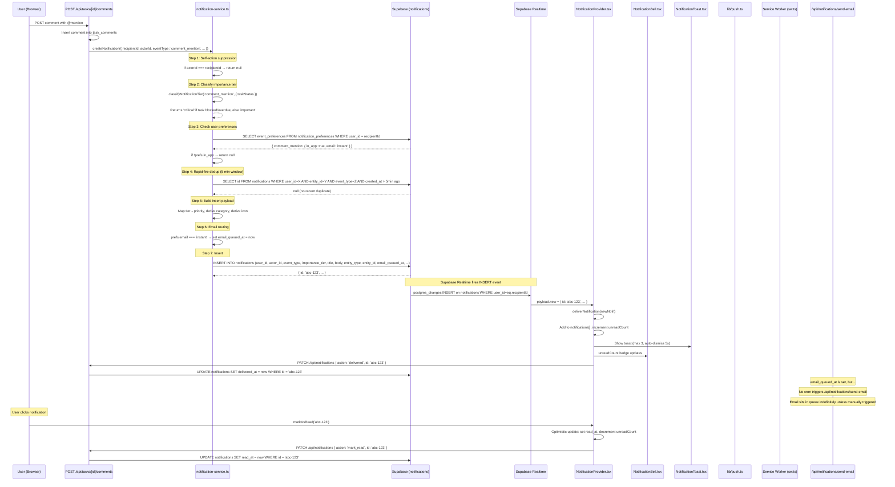
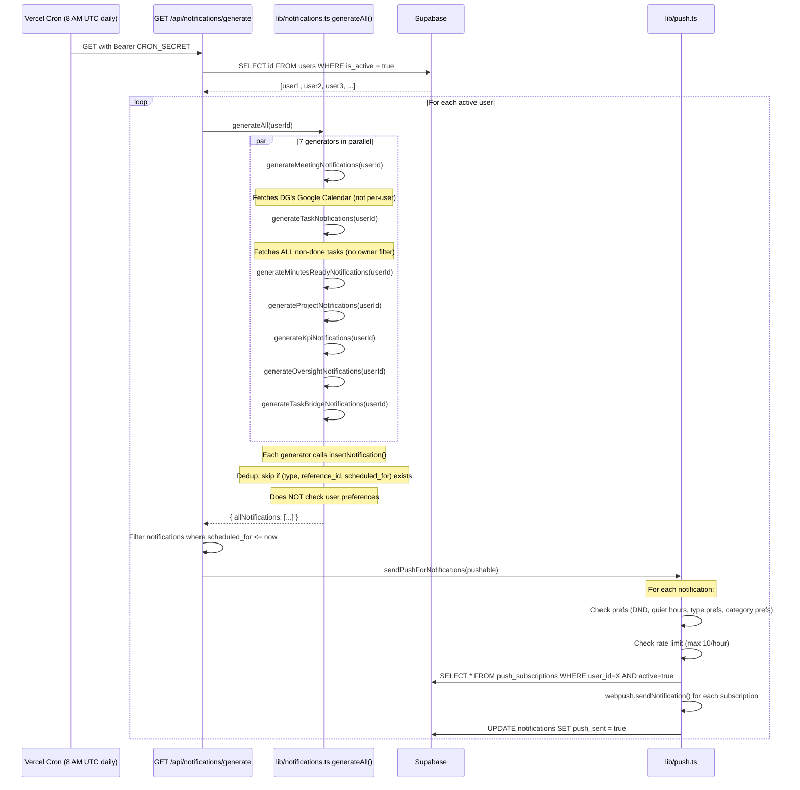

# Notifications System Audit

**Date:** 2026-04-16
**Scope:** Read-only audit of the DG Work OS notification lifecycle
**Auditor:** Claude Code

---

## Findings Table

| # | Severity | Finding | File:Line | Section |
|---|----------|---------|-----------|---------|
| F-01 | **Critical** | Task notification generators ignore assignee/owner — all tasks in the system fan out to the calling user regardless of ownership | `lib/notifications.ts:326-398` | 2.1 |
| F-02 | **Critical** | Meeting notification generator uses DG's Google Calendar for all users — `fetchWeekEvents(undefined)` reads the DG's calendar, but notifications are stamped with whichever `userId` is passed | `lib/notifications.ts:226` | 2.1 |
| F-03 | **High** | Email send and digest routes have no cron trigger — `/api/notifications/send-email` and `/api/notifications/digest` are not in `vercel.json` crons, so queued/digest emails are never sent unless manually triggered | `vercel.json:10-31` | 2.4 |
| F-04 | **High** | Two parallel notification systems with no shared read state — Legacy `task_notifications` (PostgreSQL) and `notifications` (Supabase) are independent; the task-bridge is one-directional and does not sync read/dismiss state back | `lib/task-notifications.ts`, `lib/notification-generators/task-bridge.ts` | 2.6 |
| F-05 | **High** | `markAsRead` has no ownership check — any authenticated user can mark any other user's notification as read by passing the notification ID | `lib/notifications.ts:133-138` | 2.2 |
| F-06 | **High** | Old-system generators (meetings, tasks, projects, KPI, oversight, task-bridge) ignore `event_preferences` — they call `insertNotification()` which has no preference check; only the v2 `createNotification()` respects preferences | `lib/notifications.ts:198-217` | 2.5 |
| F-07 | **Medium** | Client unread count drifts from server — `deliverNotification()` increments `unreadCount` by 1 via `setUnreadCount(prev => prev + 1)` without checking whether the notification is already in the list (dedup is on the array, not the count) | `components/notifications/NotificationProvider.tsx:148-154` | 2.3 |
| F-08 | **Medium** | Realtime subscription uses anon key with no auth token — Supabase client created with `NEXT_PUBLIC_SUPABASE_ANON_KEY` but no `accessToken`, so RLS filters on `auth.uid()` may not match, causing notifications to not appear via realtime | `components/notifications/NotificationProvider.tsx:102-104` | 2.5 |
| F-09 | **Medium** | Duplicate notification paths for mentions — `mention-notify/route.ts` calls v2 `createNotification()` while `comments/route.ts` also calls `createNotification()` for mentions in the same comment; the client calls both sequentially | `app/api/tasks/mention-notify/route.ts`, `app/api/tasks/[id]/comments/route.ts:117` | 2.6 |
| F-10 | **Medium** | No retry mechanism for failed emails — if `sendEmail()` fails, `email_sent_at` remains null, but nothing re-processes the queue later since there's no cron for send-email | `app/api/notifications/send-email/route.ts:112-114` | 2.4 |
| F-11 | **Medium** | `generateAll()` scheduled_for is always `morningSlot` (08:00 UTC today) — all generated notifications share the same timestamp, so the dedup key `(type, reference_id, scheduled_for)` prevents re-firing on re-runs but also prevents updating stale notifications until the next calendar day | `lib/notifications.ts:336,345,362,380` | 2.6 |
| F-12 | **Low** | Quiet hours use server-local time, not user timezone — `isInQuietHours()` uses `new Date().getHours()` which is the server's timezone (UTC on Vercel), not the user's timezone (likely GYT, UTC-4) | `lib/push.ts:191-205` | 2.5 |
| F-13 | **Low** | Superadmin receives all broadcast notifications — no exclusion logic exists; the DG user receives every notification generated by the cron or on session load | Throughout generators | 2.7 |
| F-14 | **Low** | Rate limit counter uses `created_at` instead of push send time — `getPushCountLastHour()` counts notifications with `push_sent=true` by `created_at`, which may undercount if pushes are sent well after creation | `lib/push.ts:172-183` | 2.5 |

---

## Part 1: How It Actually Works

### 1.1 Architecture Overview

The notification system has two layers built at different times:

1. **Legacy system** (`task_notifications` in PostgreSQL via `lib/task-notifications.ts`) — Used by the Task Management module (`/api/tm/` routes). Stores notifications in a PG table with simple `is_read` boolean. Has its own email sending via `sendTaskEmail()`.

2. **Primary system** (`notifications` in Supabase via `lib/notifications.ts` + `lib/notifications/notification-service.ts`) — The main notification system with two sub-generations:
   - **V1 generators** — `insertNotification()`: meetings, tasks, projects, KPI, oversight, task-bridge. Batch-generated by cron or session init.
   - **V2 event-based** — `createNotification()`: comment mentions, replies, task assignments, status changes, blocks, completions. Triggered in real-time by user actions.

### 1.2 End-to-End Sequence Diagram

The following traces **a comment mention notification** (the most complete path through the v2 system):

### 1.3 Notification Generation (Cron Path)

For the **batch-generated notifications** (meetings, tasks, projects, KPI, oversight, task-bridge), the flow diverges:

### 1.4 Notification Table Schema

**Table: `notifications`** (Supabase)

| Column | Type | Default | Purpose |
|--------|------|---------|---------|
| `id` | UUID | gen_random_uuid() | Primary key |
| `user_id` | TEXT | 'dg' | Recipient |
| `actor_id` | TEXT | null | Who triggered (v2 only) |
| `type` | TEXT | - | e.g. `meeting_reminder_1h`, `comment_mention` |
| `event_type` | TEXT | null | Granular event name (v2 only) |
| `importance_tier` | TEXT | 'informational' | `critical` / `important` / `informational` |
| `title` | TEXT | - | Notification title |
| `body` | TEXT | '' | Notification body |
| `icon` | TEXT | null | Icon hint |
| `priority` | TEXT | 'medium' | `low` / `medium` / `high` / `urgent` |
| `category` | TEXT | 'system' | `meetings` / `tasks` / `projects` / `kpi` / `oversight` / `system` |
| `source_module` | TEXT | 'system' | Originating module |
| `reference_type` | TEXT | null | Entity type for navigation |
| `reference_id` | TEXT | null | Entity ID |
| `reference_url` | TEXT | null | URL path for click-through |
| `entity_type` | TEXT | null | v2 entity type |
| `entity_id` | TEXT | null | v2 entity ID |
| `parent_entity_type` | TEXT | null | v2 parent entity |
| `parent_entity_id` | TEXT | null | v2 parent entity ID |
| `scheduled_for` | TIMESTAMPTZ | - | When to deliver |
| `delivered_at` | TIMESTAMPTZ | null | When shown in UI |
| `read_at` | TIMESTAMPTZ | null | When user clicked/read |
| `seen_at` | TIMESTAMPTZ | null | (unused in code) |
| `dismissed_at` | TIMESTAMPTZ | null | When user dismissed |
| `push_sent` | BOOLEAN | false | Whether push was delivered |
| `email_queued_at` | TIMESTAMPTZ | null | Set when instant email queued |
| `email_sent_at` | TIMESTAMPTZ | null | Set when email actually sent |
| `digest_eligible` | BOOLEAN | false | Whether to include in digest |
| `digest_batch_id` | UUID | null | (unused in code) |
| `action_required` | BOOLEAN | false | Whether user action is needed |
| `action_type` | TEXT | null | `review` / `acknowledge` / `view` |
| `expires_at` | TIMESTAMPTZ | null | (unused in code) |
| `metadata` | JSONB | {} | Arbitrary context |
| `created_at` | TIMESTAMPTZ | now() | Insert time |
| `updated_at` | TIMESTAMPTZ | now() | Last update time |

**Key indexes:**
- `(user_id, created_at DESC) WHERE read_at IS NULL` — unread query
- `(type, reference_id, scheduled_for)` — dedup (v1 generators)
- `(user_id, entity_id, event_type, created_at)` — dedup (v2 rapid-fire)
- `(user_id, digest_eligible) WHERE email_sent_at IS NULL AND digest_eligible = TRUE` — digest processing

### 1.5 Recipient Determination

| Notification Source | How Recipients Are Determined |
|---|---|
| **Cron generators** (meetings, tasks, projects, KPI, oversight, task-bridge) | Iterates all active users from `users` table. Each user gets identical notifications for the same events. There is **no** filtering by role, agency, task ownership, or project membership. |
| **`createNotification()` v2** (mentions, replies, assignments, status changes, blocks, completions) | Explicit `recipientId` parameter. Determined by the calling code: assignee, commenter, DG users, parent comment author, etc. |
| **Legacy `task_notifications`** (PostgreSQL) | Explicit `user_id` parameter at creation time. |

### 1.6 Delivery Channels

| Channel | Trigger | Code Path | Status |
|---|---|---|---|
| **In-app** | INSERT into `notifications` table | Supabase Realtime → `NotificationProvider` → toast + list | Working |
| **Web Push** | Called after cron generation; also by v2 for instant notifications | `lib/push.ts:sendPushForNotification()` → `webpush.sendNotification()` | Working (cron path only) |
| **Instant Email** | `email_queued_at` set at insert time by v2 `createNotification()` | `POST /api/notifications/send-email` processes queue → `lib/email.ts` → SMTP | **Broken**: no cron trigger |
| **Digest Email** | `digest_eligible=true` set at insert time by v2 `createNotification()` | `POST /api/notifications/digest` groups by user → renders HTML → SMTP | **Broken**: no cron trigger |
| **WhatsApp** | N/A | Does not exist | N/A |
| **SMS** | N/A | Does not exist | N/A |

### 1.7 Read State Lifecycle

1. **Notification created** → `read_at = null`, `delivered_at = null`
2. **Realtime delivers to UI** → client calls `PATCH { action: 'delivered', id }` → sets `delivered_at`
3. **User clicks notification** → client optimistically sets `read_at` and decrements badge → calls `PATCH { action: 'mark_read', id }` → sets `read_at` in DB
4. **User clicks "Mark all read"** → client sets all `read_at` and zeros badge → calls `PATCH { action: 'mark_all_read' }` → sets `read_at` on all unread for user
5. **User clicks "Clear all"** → client empties list → calls `PATCH { action: 'dismiss_all' }` → sets `dismissed_at` on all undismissed for user

**Unread badge count** (server): `SELECT COUNT(*) FROM notifications WHERE user_id=X AND read_at IS NULL AND dismissed_at IS NULL AND scheduled_for <= now()`

**Unread badge count** (client): `unreadCount` state variable, fetched from server on load and every 60s, incremented by +1 for each realtime INSERT, decremented by -1 for each `markAsRead` call.

### 1.8 Where Other Notification Types Deviate

| Notification Type | Deviation from comment_mention base flow |
|---|---|
| **Meeting reminders** (v1) | Created by cron `generateAll()` → `insertNotification()`. No preference check. No `actor_id`, `event_type`, `importance_tier`, `email_queued_at`. Dedup on `(type, reference_id, scheduled_for)`. Push sent in cron loop. |
| **Task due/overdue** (v1) | Same as meeting. Additionally fetches ALL tasks regardless of owner. |
| **Project delayed/stalled** (v1) | Same as meeting. Reads from project-queries. |
| **KPI alerts** (v1) | Bridges from PostgreSQL `alerts` table. Same generator pattern. |
| **Oversight** (v1) | Reads from filesystem JSON (`scraper/output/oversight-highlights-latest.json`). |
| **Task bridge** (v1) | One-directional bridge from PG `task_notifications` → Supabase `notifications`. |
| **Task assigned/blocked/completed** (v2) | Uses `createNotification()`. Has preference checks, tier classification, dedup, email routing. Push NOT sent automatically (only cron sends push). |
| **Legacy task_notifications** (PG) | Completely separate system. Own table, own read state, own email sending. UI uses different components. |

---

## Part 2: Intended vs Actual

### 2.1 Who Receives a Given Notification Type

**Intent** (from code naming and UI): Each user should receive notifications relevant to them — their tasks, their meetings, their agency's data.

**Actual**:
- **V1 generators (cron path)**: `generateAll(userId)` is called for each active user. However:
  - `generateTaskNotifications()` at `lib/notifications.ts:326` does `SELECT ... FROM tasks WHERE status != 'done'` with **no user filter**. Every active user receives notifications for every non-done task in the system. **[F-01]**
  - `generateMeetingNotifications()` at `lib/notifications.ts:226` calls `fetchWeekEvents(undefined)` which reads from a fixed Google Calendar connection (the DG's). All users receive meeting notifications for the DG's calendar. **[F-02]**
  - `generateProjectNotifications()` generates for all delayed/stalled projects for every user — likely correct for DG/PS/Minister, but agency users receive alerts for projects outside their agency.
  - `generateKpiNotifications()` generates for all agencies for every user — same issue.

- **V2 (event-based)**: Correctly targeted. `recipientId` is explicitly set to the task owner, assignee, mentioned user, etc. Self-action suppression works.

### 2.2 When a Notification Is Marked Read

**Intent**: User interaction (click or "mark all") should mark notifications as read. Only the recipient should be able to mark their own notifications.

**Actual**:
- `markAsRead()` at `lib/notifications.ts:133-138` does `UPDATE notifications SET read_at = now() WHERE id = notificationId` with **no user_id check**. Any authenticated user who knows (or guesses) a notification UUID can mark another user's notification as read. **[F-05]**
- `markAllRead()` at `lib/notifications.ts:141-147` correctly filters by `user_id`.
- The PATCH route at `app/api/notifications/route.ts:58-59` extracts `userId` from session but only passes it for `mark_all_read` and `dismiss_all`. For `mark_read`, it passes only the `id`.

### 2.3 What the Unread Badge Count Represents

**Intent**: The number of unread, undismissed notifications whose scheduled_for has passed.

**Actual (server)**: `getUnreadCount()` at `lib/notifications.ts:120-131` correctly counts `WHERE read_at IS NULL AND dismissed_at IS NULL AND scheduled_for <= now()`. This is authoritative.

**Actual (client)**: `unreadCount` is initialized from the server value but then mutated by:
- `+1` for each Realtime INSERT (even if the notification was already fetched in the periodic poll)
- `-1` for each `markAsRead` call
- Reset to `0` on `markAllRead` or `dismissAll`
- Re-synced from server every 60s via `fetchNotifications()`

**Drift scenario [F-07]**: If a notification is inserted, the Realtime handler fires and increments the count by 1. If the 60s poll fires shortly after and re-fetches, it re-sets the count from the server. But if two Realtime INSERTs arrive between polls, and one was already counted by the previous poll, the count will be too high until the next poll. The `setNotifications` dedup (`.some(n => n.id === notif.id)`) prevents duplicate entries in the list, but the `setUnreadCount(prev => prev + 1)` fires unconditionally before that check resolves.

### 2.4 Whether User Preferences Are Respected

**Intent** (from `NotificationPreferences.tsx` UI): Users can toggle individual event types on/off for in-app and email channels. Meeting reminders, task alerts, project/KPI/oversight categories have independent toggles. Quiet hours and DND should suppress push.

**Actual**:
- **V2 `createNotification()`**: Fully respects `event_preferences`. Checks `in_app` flag; routes email via `email_queued_at` or `digest_eligible` based on the email preference. Working correctly.
- **V1 `insertNotification()` generators**: **Do not check any preferences.** `insertNotification()` at `lib/notifications.ts:198-217` has no preference lookup. All meeting reminders, task alerts, project/KPI/oversight notifications are always created regardless of user settings. **[F-06]**
- **Push delivery** (`lib/push.ts:209-288`): Correctly checks DND, quiet hours, type-level prefs (`meeting_reminder_24h`, etc.), and category-level prefs (`projects_enabled`, etc.). But this only controls push — the in-app notification is already inserted.
- **Quiet hours**: Use server-local time (`new Date().getHours()`), not user timezone. **[F-12]**

### 2.5 What Happens When an Event Fires Twice

**V1 generators**: Deduplication via `exists(type, reference_id, scheduled_for)` at `lib/notifications.ts:177-187`. Since `scheduled_for` is the same `morningSlot` each day, re-running `generateAll()` on the same day is idempotent — the second run finds existing rows and skips. Re-running on a new day generates new notifications (new `morningSlot`). This works as intended.

**V2 `createNotification()`**: 5-minute rapid-fire dedup at `lib/notifications/notification-service.ts:200-238`. If the same `(user_id, entity_id, event_type)` appears within 5 minutes, it updates the existing row instead of inserting. After 5 minutes, it inserts a new row. This is intentional — it allows repeated events (e.g., multiple status changes) to create new notifications after a cooldown.

**Comment mention dual-path [F-09]**: When a comment with mentions is posted, `app/api/tasks/[id]/comments/route.ts:117` calls `createNotification()` inline for each mention. The client then also calls `POST /api/tasks/mention-notify` which calls `createNotification()` again for the same mentions. The 5-minute dedup prevents duplicate inserts (the second call updates the existing row). This is wasteful but not harmful.

### 2.6 What Happens When a Delivery Channel Fails

**Push failure**: If `webpush.sendNotification()` throws with 410/404, the subscription is deactivated. For other errors, the failure is logged and the loop continues to the next subscription. If all subscriptions fail, `push_sent` remains `false`. There is no retry mechanism; the push is lost.

**Email failure**: `sendEmail()` returns `{ success: false, error }`. The `send-email` route increments a `failed` counter and continues. `email_sent_at` is not set, so the notification remains in the queue. In theory, re-running the send-email route would retry. In practice, there is no cron to do this. **[F-10]**

**In-app (Realtime) failure**: If the Supabase Realtime channel disconnects, the client falls back to 60-second polling. This is resilient.

### 2.7 Whether the Superadmin Receives, Is Excluded From, or Silently Drops Notifications

**Intent**: Unclear from the code. No comments or documentation specify.

**Actual**: The superadmin (`alfonso.dearmas@mpua.gov.gy`, role `dg`) is a normal active user. They:
- Are included in the cron's `SELECT id FROM users WHERE is_active = true` loop
- Receive all v1 broadcast notifications (every task, every project, every KPI alert)
- Receive v2 targeted notifications when they are the explicit recipient (e.g., task_blocked notifications go to all DG users)
- Self-action suppression in v2 means they don't get notifications for their own actions
- There is no exclusion or special handling **[F-13]**

---

## Part 3: Specific Symptoms to Investigate

Since no specific user-reported symptoms were provided, the following are **predicted symptoms** based on the code analysis. Each would be observable in production.

### 3.1 "I get notifications for tasks that aren't mine"

**Trace**: The cron at 8 AM UTC calls `generateAll()` for each active user. `generateTaskNotifications()` at `lib/notifications.ts:326-398` runs `SELECT id, title, agency, due_date, status FROM tasks WHERE status != 'done'` — no `WHERE owner_user_id = userId` or `WHERE assigned_to = userId`. Every non-done task generates a due/overdue notification for every active user.

**Root cause**: F-01. The query has no ownership filter.

**Verification**: Run `SELECT user_id, COUNT(*) FROM notifications WHERE type IN ('task_due_today','task_due_tomorrow','task_overdue') GROUP BY user_id` — all active users should have roughly the same count.

### 3.2 "Meeting reminders are for meetings I'm not invited to"

**Trace**: `generateMeetingNotifications()` at `lib/notifications.ts:226` calls `fetchWeekEvents(undefined, { hoursAhead: 25 })`. In `lib/google-calendar.ts`, `fetchWeekEvents(undefined)` uses the default (DG's) Google Calendar connection. The resulting events are stamped with whatever `userId` is passed. Non-DG users receive reminders for the DG's meetings.

**Root cause**: F-02. No per-user calendar integration in the generator.

**Verification**: Check if non-DG users have `type='meeting_reminder_*'` notifications. Then compare the `reference_id` (Google Calendar event ID) against the DG's calendar.

### 3.3 "I never get email notifications"

**Trace**: The v2 `createNotification()` correctly sets `email_queued_at` for events configured as "instant" email. However, `vercel.json` has no cron entry for `/api/notifications/send-email` or `/api/notifications/digest`. These routes must be called manually or by an external trigger that does not appear in the codebase.

**Root cause**: F-03. Email processing routes have no scheduled trigger.

**Verification**: Run `SELECT COUNT(*) FROM notifications WHERE email_queued_at IS NOT NULL AND email_sent_at IS NULL` — a growing count confirms the queue is never drained.

### 3.4 "Badge count sometimes shows wrong number, then corrects itself"

**Trace**: The NotificationProvider at line 153-154 does `setUnreadCount(prev => prev + 1)` every time a Realtime INSERT fires. If a notification is created and the INSERT fires, but the periodic 60s poll also picked it up, the count is incremented once by the poll (server value) and once by the Realtime handler. The list dedup at line 149 prevents the notification from appearing twice, but the count increment is not conditional on the dedup result.

**Root cause**: F-07. The count increment is unconditional.

**Verification**: Open the app, wait for initial load, then trigger a notification. Observe the badge — it may show N+1 correctly. Then wait 60s for the poll. If the server count is N+1 (correct), the client already shows N+1, so no visible issue. The race condition manifests when a Realtime INSERT arrives in the narrow window between the poll HTTP request and the state update.

### 3.5 "Realtime notifications don't appear until I refresh"

**Trace**: The Supabase Realtime subscription at `NotificationProvider.tsx:102-104` creates a client with `createClient(url, key)` using the anon key. Supabase RLS on the `notifications` table (migration 051) checks `auth.uid()::text = user_id OR (current_setting('request.jwt.claims', true)::json->>'sub')::text = user_id`. The anon key client has no authenticated session, so `auth.uid()` returns null. The fallback JWT claim check may also fail.

**Root cause**: F-08. The Realtime client is unauthenticated.

**Verification**: Check the Supabase Realtime logs for policy violations on the `notifications` table. If RLS is enforced on Realtime, the subscription would silently receive no events. However, Supabase Realtime with `postgres_changes` may bypass RLS depending on the publication setup — if the `supabase_realtime` publication was created with `FOR ALL TABLES` (which is the default), it streams all changes regardless of RLS. This needs to be verified in the Supabase dashboard.

### 3.6 "I dismissed all notifications but the legacy task inbox still shows unread"

**Trace**: There are two completely separate notification stores:
1. `notifications` (Supabase) — managed by `NotificationProvider`, shown in the bell/panel
2. `task_notifications` (PostgreSQL) — managed by the Task Management module

The "Mark all read" and "Clear all" actions in the notification panel only affect the Supabase `notifications` table. The PostgreSQL `task_notifications` table is untouched. If the Task Management UI has its own unread indicator, it would remain.

**Root cause**: F-04. Two independent systems with no synchronized state.

**Verification**: Call both `getUnreadCount()` from `lib/notifications.ts` (Supabase) and `getUnreadCount()` from `lib/task-notifications.ts` (PG) for the same user and compare.

---

## Appendix: File Reference

| File | Purpose |
|------|---------|
| `lib/notifications.ts` | V1 CRUD, generators (meetings/tasks/minutes), preferences, types |
| `lib/notifications/notification-service.ts` | V2 event-based creation, dedup, bulk, collapse |
| `lib/notifications/classify-tier.ts` | Importance tier classification |
| `lib/notifications/email-templates.ts` | Instant + digest email HTML renderers |
| `lib/notifications/email-utils.ts` | URL builder, cron auth check |
| `lib/notifications/mention-utils.ts` | @mention extraction |
| `lib/push.ts` | Web Push: VAPID, subscriptions, rate limit, quiet hours, send |
| `lib/email.ts` | SMTP sender (Gmail) |
| `lib/task-notifications.ts` | Legacy PG notification system |
| `lib/mention-notifications.ts` | Legacy mention handler (uses insertNotification) |
| `lib/notification-generators/projects.ts` | Delayed/stalled project notifications |
| `lib/notification-generators/kpi.ts` | KPI alert + stale data notifications |
| `lib/notification-generators/oversight.ts` | Oversight highlights from scraper JSON |
| `lib/notification-generators/task-bridge.ts` | PG task_notifications → Supabase bridge |
| `app/api/notifications/route.ts` | GET (list) + PATCH (read/dismiss/deliver) |
| `app/api/notifications/generate/route.ts` | Cron + session generation trigger |
| `app/api/notifications/preferences/route.ts` | GET/PUT preferences |
| `app/api/notifications/send-email/route.ts` | Process instant email queue |
| `app/api/notifications/digest/route.ts` | Process digest email queue |
| `app/api/push/subscribe/route.ts` | Push subscription management |
| `app/api/push/vapid-key/route.ts` | VAPID public key |
| `app/api/push/test/route.ts` | Test push |
| `app/api/push/diagnose/route.ts` | Push diagnostics |
| `app/api/tasks/mention-notify/route.ts` | V2 mention notification (duplicate path) |
| `app/api/tasks/[id]/route.ts` | Task PATCH triggers assignment/block/status/complete notifications |
| `app/api/tasks/[id]/comments/route.ts` | Comment POST triggers mention/reply notifications |
| `components/notifications/NotificationProvider.tsx` | Client state, polling, Realtime, toasts |
| `components/notifications/NotificationBell.tsx` | Bell icon + badge |
| `components/notifications/NotificationPanel.tsx` | Notification list/filters |
| `components/notifications/NotificationItem.tsx` | Individual notification row |
| `components/notifications/NotificationToast.tsx` | Toast popup |
| `components/notifications/NotificationPreferences.tsx` | Preferences UI |
| `components/notifications/PushNotificationSettings.tsx` | Push management UI |
| `components/notifications/PushPromptBanner.tsx` | Push permission prompt |
| `app/sw.ts` | Service worker (push handler) |
| `supabase/migrations/009_notifications.sql` | Initial schema |
| `supabase/migrations/010_push_subscriptions.sql` | Push subscriptions table |
| `supabase/migrations/014_notifications_v2.sql` | Expanded schema |
| `supabase/migrations/051_notification_system_overhaul.sql` | Event-based overhaul |
| `vercel.json` | Cron definitions |
